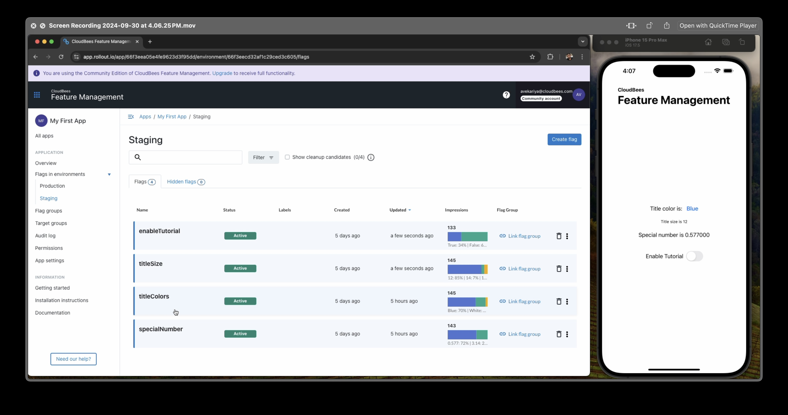

# Example Swift iOS application for CloudBees platform feature management
Use this example application to integrate with the CloudBees platform and test out feature management. After integrating, watch the application display change in response to any updates you make to flag values in the platform.

In the example swift application, the ROX SDK is already set up, and feature flags are already coded in.


## Running This Project
To get started with the swift-fm-example project, follow these steps:

1. **Get key from Cloudbees account:** 

    - Create a CloudBees Feature Management account. See [Signup Page](https://app.rollout.io/signup) to create an account.
    - Get your environment key. Copy your environment key from App settings > Environments > Key.

2. **Clone the Repository:** 
Clone the swift-fm-example repository to your local machine using Git:

```shell
git@github.com:cloudbees-io/swift-fm-example.git
```
3. **Install ROX dependancy via pod:**
   - Install CocoaPods as described in [CocoaPods Getting Started](https://guides.cocoapods.org/using/getting-started.html#getting-started).
   - In Terminal, `cd` to your project directory and type `pod install`.
 

4. **Open the Project:**
 
    - Reopen your project in Xcode using the new `.xcworkspace` file.

5. **Setup key from Cloudbees account:** 

    - In the ConfigurationManager.swift file, replace the `<Your Cloudbees Environment API Key>` with your corresponding API key:
   
    ```
        ROX.setup(withKey: "<Your Cloudbees Environment API Key>", options: options)
    ```

6. **Run the swift-fm-example App:** 

    - Use Xcode to run the swift-fm-example app by selecting Product > Run or by pressing Cmd + R. This will launch the app.

## Use the platform to update flag values

Now that your application is running, go to your environment in Feature management to display the flags available in the example application:

Table 1. Feature flags in the example application.

| Flag name           | Flag type  | Description                    |
|---------------------|------------|--------------------------------|
| `enableTutorial`| Boolean | Turns the Tutorial on or off |
| `titleColors`| String | Sets the font color. The flag value has the following variations: red, green, or blue.|
| `titleSize` | Int32   | Sets the font size in pixels. The flag value has the following variations: 12, 16, or 24.|
| `specialNumber` | Double   | Sets the number with double. The flag value has the following variations: 2.72, 0.577, 3.14|

**To update flags in the platform UI:** 

1. Select **Feature management** from the left pane.
2. Select the vertical ellipsis icon next to the flag you want to configure.
3. Select **Configure**.
4. Select the **Environment** you used for copying the SDK key.
5. Update a flag value and save your changes.
6. Switch the **Configuration status** to **On**.

## Video Preview

[](fm-screen-rec.mov)
